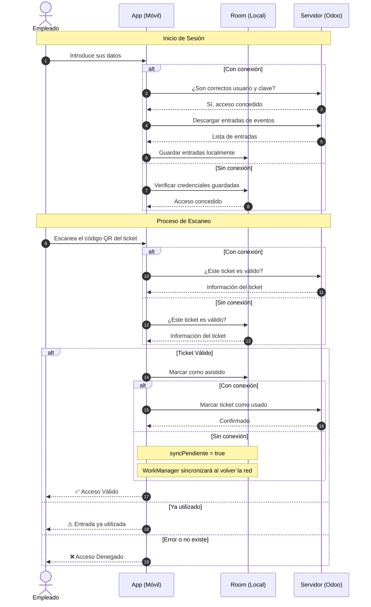
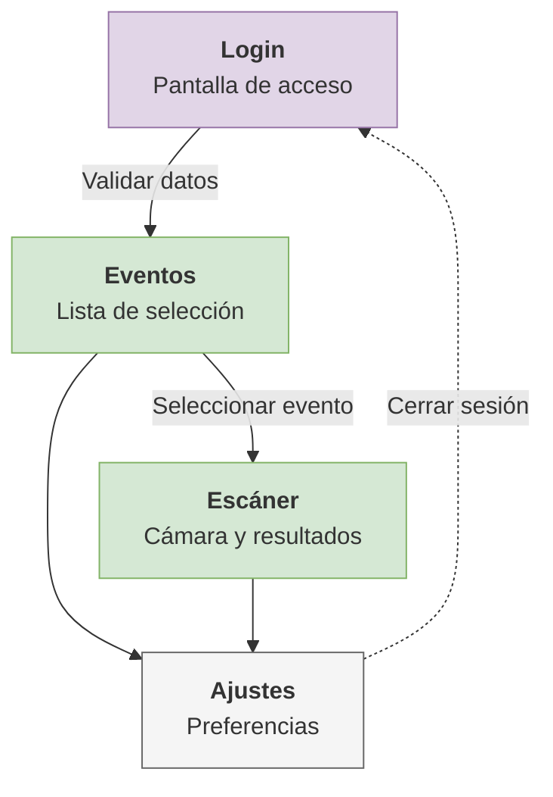
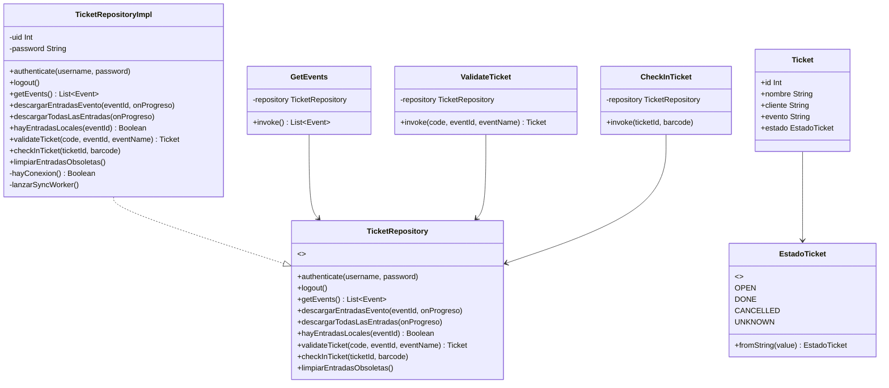
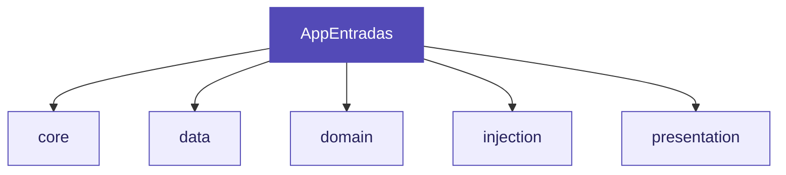
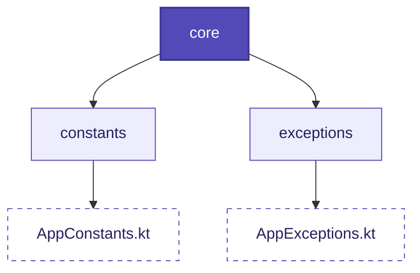
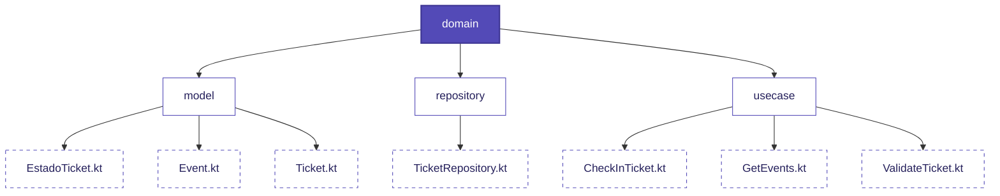
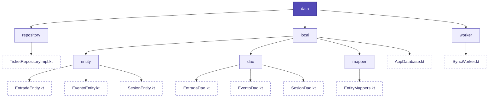
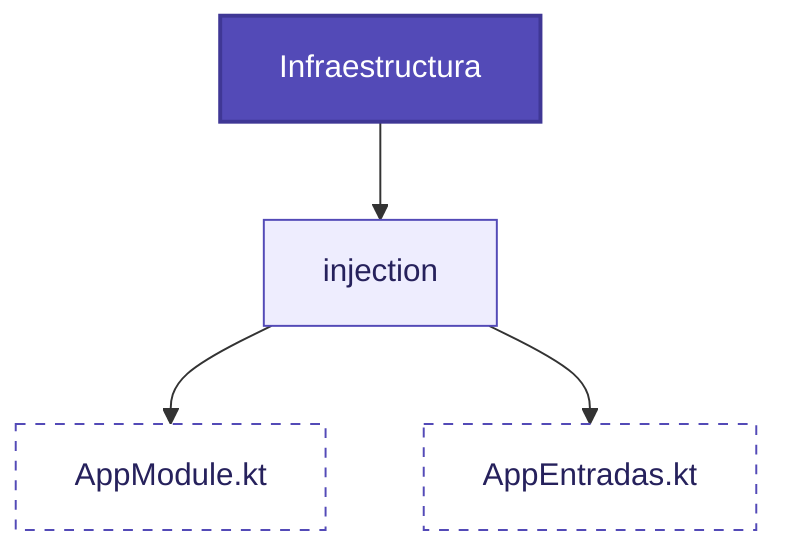
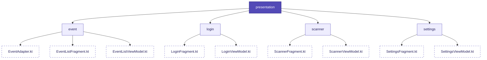

# Eventum — App de control de acceso a eventos

# Índice

1. [**Introducción**](#1-introduccion)
2. [**Requisitos del sistema**](#2-requisitos-del-sistema)
3. [**Flujo de la aplicación**](#3-flujo-de-la-aplicacion)
4. [**Diagrama de Navegación**](#4-diagrama-de-navegacion)
5. [**Arquitectura**](#5-arquitectura)
    * 5.1. [Estructura de paquetes](#51-estructura-de-paquetes)
    * 5.1.1. [Core](#511-core)
    * 5.1.2. [Domain](#512-domain)
    * 5.1.3. [Data](#513-data)
    * 5.1.4. [Injection](#514-injection)
    * 5.1.5. [Presentation](#515-presentation)
6. [**Comunicación con Odoo**](#6-comunicacion-con-odoo)
7. [**Gestión de errores**](#7-gestion-de-errores)
8. [**Dependencias principales**](#8-dependencias-principales)
9. [**Configuración de la conexión**](#9-configuracion-de-la-conexion)
10. [**Tests**](#10-tests)

---
# 1. Introduccion
Eventum es una aplicación Android nativa desarrollada en Kotlin para el control de acceso a eventos. Permite al personal escanear códigos QR de entradas y validarlas contra la base de datos de Odoo, funcionando tanto con conexión a internet como en modo offline.

Al iniciar sesión, la app descarga automáticamente todas las entradas de los eventos disponibles y las almacena en una base de datos local cifrada con SQLCipher. Durante el evento puede trabajar sin conexión y sincroniza automáticamente los check-ins pendientes con Odoo en cuanto el dispositivo recupera la red.

# 2. Requisitos del sistema

**Dispositivo:**
- Android 7.0 (API 24) o superior
- Cámara trasera con autofoco
- Conexión a internet recomendada (no obligatoria para escanear)
- Mínimo 50MB de almacenamiento libre

**Entorno de desarrollo:**
- Android Studio
- JDK 17 o 21
- Kotlin 2.0 o superior
- Gradle 8.x


---

# 3. Flujo de la aplicación

El flujo comienza cuando el empleado abre la app e inicia sesión. Si hay conexión, autentica contra Odoo, guarda la sesión hasheada con BCrypt y descarga todas las entradas. Si no hay conexión, verifica las credenciales contra la sesión guardada localmente.

Una vez dentro, selecciona el evento y empieza a escanear. Si hay conexión consulta Odoo en tiempo real. Si no hay conexión valida contra Room local. Los check-ins sin red quedan como `syncPendiente = true` y WorkManager los sincroniza en background cuando vuelve la red.



---

---

# 4. Diagrama de Navegación

El flujo de pantallas de la aplicación está diseñado para ser directo y funcional, permitiendo al empleado realizar su trabajo sin distracciones. Los componentes principales son:

*   **Login:** Es la pantalla inicial de la app. El trabajador pone sus datos y, si son correctos, la aplicación le dejará acceder a los eventos.
*   **Eventos:** En esta pantalla aparece una lista con los eventos que hay anunciados. El empleado seleccionará el evento específico de la entrada que va a escanear para cargar el contexto correcto.
*   **Escáner:** Se abrirá la cámara del móvil para leer los códigos QR. Se escanea el código de la entrada y en la parte inferior se muestra el resultado del escaneo (Válido, Ya usado o Error).
*   **Ajustes:** Es una pantalla con diferentes preferencias que podrá aplicar el empleado sobre la aplicación, como cambiar el idioma, activar el modo oscuro o cerrar sesión de forma segura.

<div align="center">



</div>

---

# 5. Arquitectura

La app implementa **Clean Architecture** dividida en tres capas con dependencias unidireccionales: la presentación depende del dominio, y el dominio no conoce ni la presentación ni los datos.


---

## 5.1. Estructura de paquetes



### 5.1.1 core

Contiene todo lo que es configuración global y valores que no cambian. Las constantes de conexión con Odoo, los nombres de los campos, los mensajes de error y las excepciones propias viven aquí para que cualquier parte de la app pueda acceder a ellos sin duplicar strings.

<div align="center">



</div>

### 5.1.2 domain

Es el núcleo de la app. No depende de Android, Odoo, ni ninguna librería externa. Contiene:

- **model** — los objetos con los que trabaja la app (`Event`, `Ticket`, `EstadoTicket`)
- **repository** — la interfaz `TicketRepository` que define las operaciones disponibles sin saber cómo se implementan
- **usecase** — las acciones de negocio (`GetEvents`, `ValidateTicket`, `CheckInTicket`), cada una con un único método `invoke`

<div align="center">



</div>


### 5.1.3 data

Contiene la implementación del repositorio y la capa de persistencia local. El repositorio detecta si hay conexión en cada operación y actúa en consecuencia.

<div align="center">


</div>

### 5.1.4 injection

Contiene el módulo Hilt `AppModule` que provee como singleton la base de datos Room, los DAOs, el repositorio y su implementación. También contiene `AppEntradas`, la clase `Application` que integra Hilt con WorkManager para que el `SyncWorker` pueda recibir dependencias inyectadas.

<div align="center">



</div>

### 5.1.5 presentation

Contiene los Fragments, ViewModels y Adapters de cada pantalla. Cada pantalla tiene su propio ViewModel que expone su estado mediante `LiveData`. Los Fragments observan ese estado y actualizan la UI. Ningún Fragment contiene lógica de negocio.

<div align="center">



</div>

---

## 6. Comunicación con Odoo

La app usa **XML-RPC**, el protocolo estándar de integración de Odoo. Se usan dos endpoints:

| Endpoint | Uso |
|---|---|
| `/xmlrpc/2/common` | Autenticación de usuarios |
| `/xmlrpc/2/object` | Operaciones sobre modelos de datos |

Los modelos y métodos usados son:

| Modelo | Método | Descripción |
|---|---|---|
| `event.event` | `search_read` | Obtener eventos en estado "Announced" |
| `event.registration` | `search_read` | Descargar todas las entradas al hacer login |
| `event.registration` | `search_read` | Buscar ticket por barcode durante el escaneo |
| `event.registration` | `action_set_done` | Marcar ticket como utilizado (Check-in) |

Las operaciones contra Odoo solo se realizan cuando hay conexión. En modo offline la app opera contra Room y sincroniza con Odoo a través del `SyncWorker` cuando vuelve la red.

---

## 7. Gestión de errores

La app define excepciones propias que extienden `RuntimeException`:

| Excepción | Cuándo se lanza |
|---|---|
| `CredencialesInvalidasException` | Las credenciales introducidas no son válidas |
| `ConexionException` | Fallo en la comunicación con Odoo |
| `TicketNotFoundException` | No se encuentra el ticket en Odoo |

Los ViewModels siempre capturan por tipo, nunca por mensaje:

```kotlin
catch (e: CredencialesInvalidasException) {
    _state.postValue(Error(AppConstants.ERROR_CREDENCIALES))
} catch (e: ConexionException) {
    _state.postValue(Error(AppConstants.ERROR_CONEXION))
} catch (e: Exception) {
    _state.postValue(Error(AppConstants.ERROR_DESCONOCIDO))
}
```

---

 8. Dependencias principales

| Librería | Versión | Uso |
|---|---|---|
| Hilt | 2.51.1 | Inyección de dependencias |
| Hilt Work | 1.2.0 | Inyección de dependencias en Workers |
| Navigation Component | 2.8.4 | Navegación y SafeArgs |
| CameraX | 1.3.2 | Acceso a cámara |
| ML Kit Barcode Scanning | 17.2.0 | Lectura de QR |
| Coil | 2.6.0 | Carga de imágenes |
| Apache XML-RPC | 3.1.3 | Comunicación con Odoo |
| Lifecycle ViewModel | 2.7.0 | Gestión ciclo de vida |
| Coroutines | 1.7.3 | Programación asíncrona |
| Room | 2.6.1 | Base de datos local SQLite |
| WorkManager | 2.9.0 | Sincronización en background |
| BCrypt | 0.4 | Hash de contraseñas para login offline |
| SQLCipher | 4.5.4 | Cifrado de la base de datos local |
| JUnit 4 | — | Tests unitarios |
| Mockito Kotlin | 5.4.0 | Mocks en tests |
| Coroutines Test | 1.7.3 | Tests con corrutinas |

---

## 9. Configuración de la conexión

Para apuntar a otra instancia de Odoo modifica estas constantes en `AppConstants.kt`:

```kotlin
const val URL_ODOO = "https://edu-pruebaeventos.odoo.com"
const val DB_NAME  = "edu-pruebaeventos"
const val DB_ROOM_NAME = "eventum.db"
const val DB_ROOM_KEY  = "eventum_db_key"
```

El usuario de Odoo necesita:
- Lectura sobre `event.event` y `event.registration`
- Ejecución de `action_set_done` sobre `event.registration`

---

## 10. Tests

La estrategia de tests cubre las capas de dominio y presentación con JUnit 4 y Mockito.

| Clase | Casos cubiertos |
|---|---|
| `EstadoTicketTest` | Conversión de cada string a su enum |
| `GetEventsTest` | Lista correcta, lista vacía, error |
| `ValidateTicketTest` | Ticket válido, null, error |
| `CheckInTicketTest` | Check-in correcto con barcode, propagación de error con barcode |
| `LoginViewModelTest` | Campos vacíos, credenciales inválidas, error conexión, éxito |
| `EventListViewModelTest` | Lista eventos, lista vacía sin error, error de conexión |
| `ScannerViewModelTest` | Ticket válido, usado, cancelado, no encontrado, error, revalidación exitosa, revalidación fallida |
