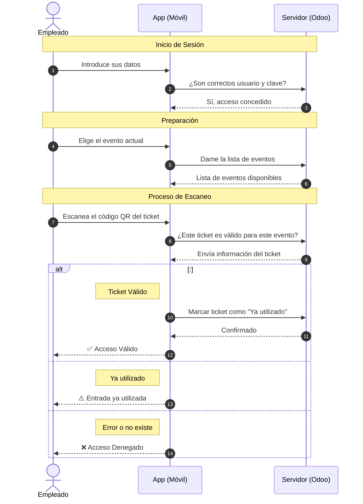
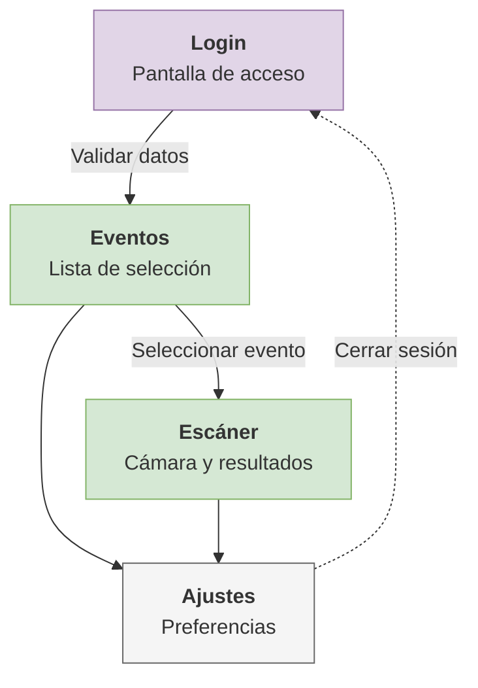
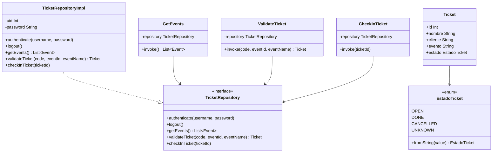
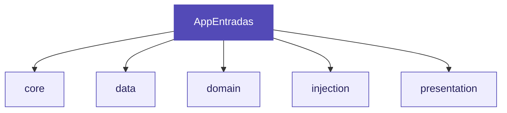
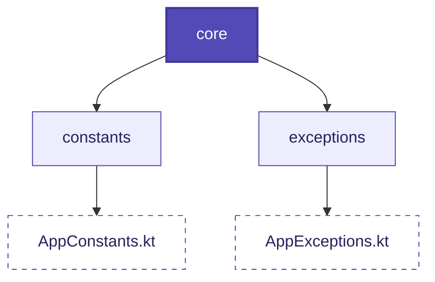
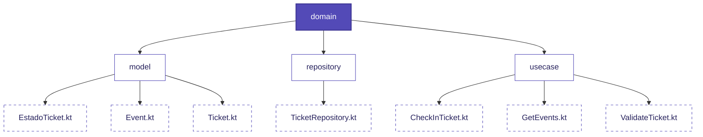
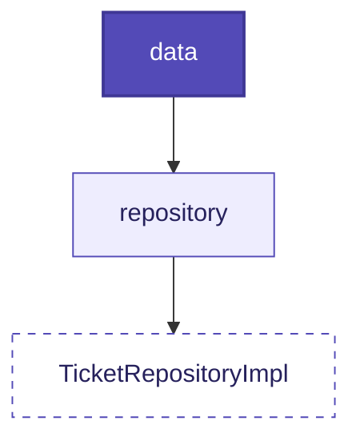
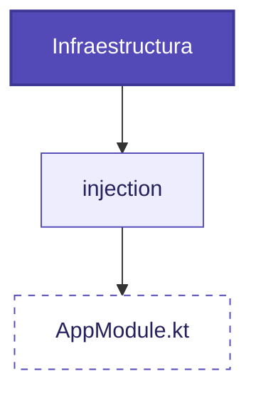
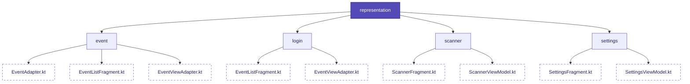

# Eventum — App de control de acceso a eventos

# 1. Introduccion
Eventum es una aplicación Android nativa desarrollada en Kotlin para el control de acceso a eventos. Permite al personal escanear códigos QR de entradas y validarlas en tiempo real contra la base de datos de Odoo.

# 2. Requisitos del sistema

**Dispositivo:**
- Android 7.0 (API 24) o superior
- Cámara trasera con autofoco
- Conexión a internet

**Entorno de desarrollo:**
- Android Studio
- JDK 11
- Kotlin 1.9 o superior
- Gradle 8.x

---

# 3. Flujo de la aplicación

El flujo comienza cuando el empleado abre la app e inicia sesión con sus credenciales de Odoo. Una vez autenticado, selecciona el evento en el que trabaja y empieza a escanear entradas. La app lee el código QR, consulta directamente con Odoo mediante XML-RPC y muestra el resultado al empleado en pantalla.



---

# 4. Diagrama de Navegación

El flujo de pantallas de la aplicación está diseñado para ser directo y funcional, permitiendo al empleado realizar su trabajo sin distracciones. Los componentes principales son:

*   **Login:** Es la pantalla inicial de la app. El trabajador pone sus datos y, si son correctos, la aplicación le dejará acceder a los eventos.
*   **Eventos:** En esta pantalla aparece una lista con los eventos que hay anunciados. El empleado seleccionará el evento específico de la entrada que va a escanear para cargar el contexto correcto.
*   **Escáner:** Se abrirá la cámara del móvil para leer los códigos QR. Se escanea el código de la entrada y en la parte inferior se muestra el resultado del escaneo (Válido, Ya usado o Error).
*   **Ajustes:** Es una pantalla con diferentes preferencias que podrá aplicar el empleado sobre la aplicación, como cambiar el idioma, activar el modo oscuro o cerrar sesión de forma segura.

<div align="center">



</div>

---

# 5. Arquitectura

La app implementa **Clean Architecture** dividida en tres capas con dependencias unidireccionales: la presentación depende del dominio, y el dominio no conoce ni la presentación ni los datos.



---

## 5.1. Estructura de paquetes



### 5.1.1 core

Contiene todo lo que es configuración global y valores que no cambian. Las constantes de conexión con Odoo, los nombres de los campos, los mensajes de error y las excepciones propias viven aquí para que cualquier parte de la app pueda acceder a ellos sin duplicar strings.

<div align="center">



</div>

### 5.1.2 domain

Es el núcleo de la app. No depende de Android, Odoo, ni ninguna librería externa. Contiene:

- **model** — los objetos con los que trabaja la app (`Event`, `Ticket`, `EstadoTicket`)
- **repository** — la interfaz `TicketRepository` que define las operaciones disponibles sin saber cómo se implementan
- **usecase** — las acciones de negocio (`GetEvents`, `ValidateTicket`, `CheckInTicket`), cada una con un único método `invoke`

<div align="center">



</div>


### 5.1.3 data

Contiene `TicketRepositoryImpl`, la única clase que sabe cómo hablar con Odoo. Implementa la interfaz `TicketRepository` y gestiona la sesión XML-RPC. Guarda el `uid` y la `password` en memoria como variables privadas que se obtienen al autenticarse y se limpian al hacer logout.

<div align="center">


</div>

### 5.1.4 injection

Contiene el módulo Hilt `AppModule` que provee el repositorio como singleton. Al ser singleton, se garantiza que solo existe una instancia del repositorio en toda la app, lo que es necesario porque guarda el estado de sesión en memoria.

<div align="center">



</div>

### 5.1.5 presentation

Contiene los Fragments, ViewModels y Adapters de cada pantalla. Cada pantalla tiene su propio ViewModel que expone su estado mediante `LiveData`. Los Fragments observan ese estado y actualizan la UI. Ningún Fragment contiene lógica de negocio.

<div align="center">



</div>

---

## 6. Comunicación con Odoo

La app usa **XML-RPC**, el protocolo estándar de integración de Odoo. Se usan dos endpoints:

| Endpoint | Uso |
|---|---|
| `/xmlrpc/2/common` | Autenticación de usuarios |
| `/xmlrpc/2/object` | Operaciones sobre modelos de datos |

Los modelos y métodos usados son:

| Modelo | Método | Descripción |
|---|---|---|
| `event.event` | `search_read` | Obtener eventos en estado "Announced" |
| `event.registration` | `search_read` | Buscar ticket por barcode y evento |
| `event.registration` | `action_set_done` | Marcar ticket como utilizado |

---

## 7. Gestión de errores

La app define excepciones propias que extienden `RuntimeException`:

| Excepción | Cuándo se lanza |
|---|---|
| `CredencialesInvalidasException` | Las credenciales introducidas no son válidas |
| `ConexionException` | Fallo en la comunicación con Odoo |
| `TicketNotFoundException` | No se encuentra el ticket en Odoo |

Los ViewModels siempre capturan por tipo, nunca por mensaje:

```kotlin
catch (e: CredencialesInvalidasException) {
    _state.postValue(Error(AppConstants.ERROR_CREDENCIALES))
} catch (e: ConexionException) {
    _state.postValue(Error(AppConstants.ERROR_CONEXION))
} catch (e: Exception) {
    _state.postValue(Error(AppConstants.ERROR_DESCONOCIDO))
}
```

---

## 8. Dependencias principales

| Librería | Versión | Uso |
|---|---|---|
| Hilt | 2.51.1 | Inyección de dependencias |
| Navigation Component | 2.8.4 | Navegación y SafeArgs |
| CameraX | 1.3.2 | Acceso a cámara |
| ML Kit Barcode Scanning | 17.2.0 | Lectura de QR |
| Coil | 2.6.0 | Carga de imágenes |
| Apache XML-RPC | 3.1.3 | Comunicación con Odoo |
| Lifecycle ViewModel | 2.7.0 | Gestión ciclo de vida |
| Coroutines | 1.7.3 | Programación asíncrona |
| JUnit 4 | — | Tests unitarios |
| Mockito Kotlin | 5.4.0 | Mocks en tests |
| Coroutines Test | 1.7.3 | Tests con corrutinas |

---

## 9. Configuración de la conexión

Para apuntar a otra instancia de Odoo modifica estas dos constantes en `AppConstants.kt`:

```kotlin
const val URL_ODOO = "https://edu-pruebaeventos.odoo.com"
const val DB_NAME  = "edu-pruebaeventos"
```

El usuario de Odoo necesita:
- Lectura sobre `event.event` y `event.registration`
- Ejecución de `action_set_done` sobre `event.registration`

---

## 10. Tests

La estrategia de tests cubre las capas de dominio y presentación con JUnit 4 y Mockito.

| Clase | Casos cubiertos |
|---|---|
| `EstadoTicketTest` | Conversión de cada string a su enum |
| `GetEventsTest` | Lista correcta, lista vacía, error |
| `ValidateTicketTest` | Ticket válido, null, error |
| `CheckInTicketTest` | Check-in correcto, error |
| `LoginViewModelTest` | Campos vacíos, credenciales inválidas, error conexión, éxito |
| `EventListViewModelTest` | Lista eventos, lista vacía, error |
| `ScannerViewModelTest` | Ticket válido, usado, cancelado, no encontrado, error, revalidación |
