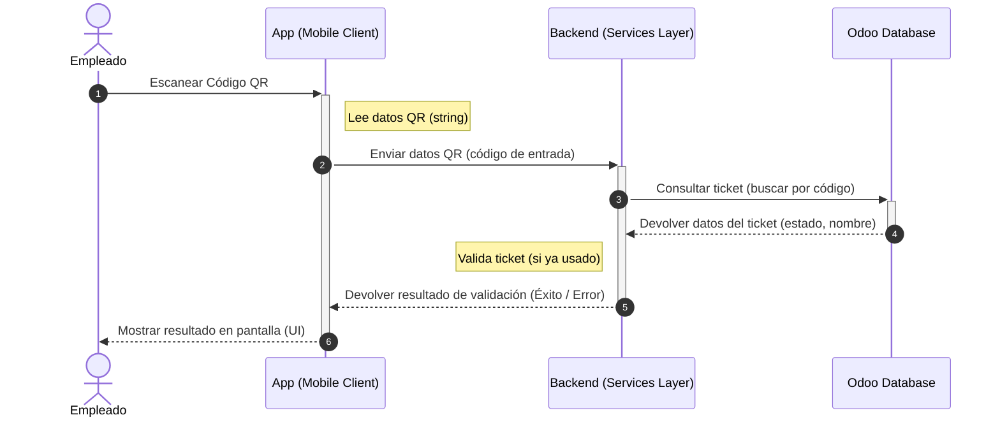
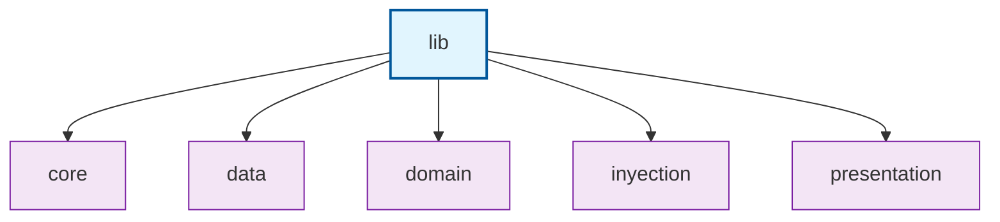
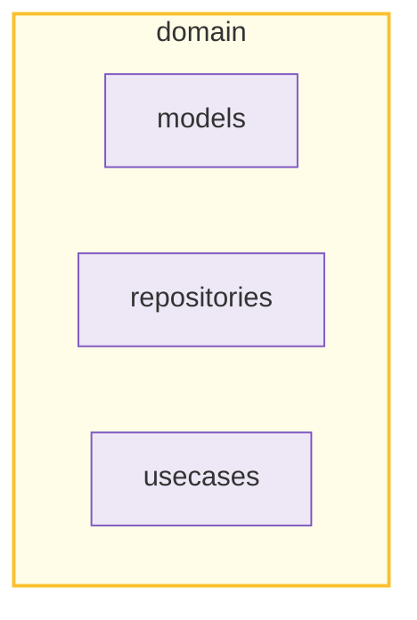
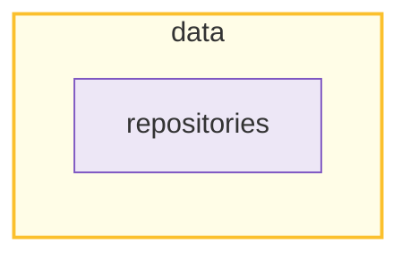
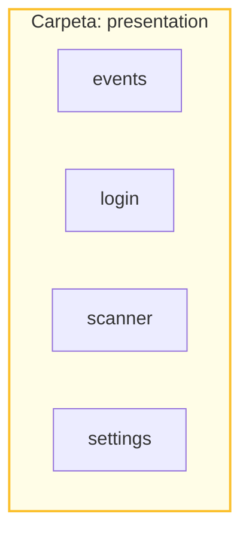

# App escaneo de entradas

La aplicación es una herramienta para gestionar el acceso a eventos mediante la validación de entradas con códigos QR. Está pensada para que los empleados puedan escanear las entradas de los asistentes y comprobar si son válidas de forma rápida.
La aplicación está conectada con Odoo, donde se almacenan los datos de eventos y entradas.

## 1. Flujo de la aplicación

El flujo de la aplicación comienza cuando el Empleado utiliza la app para escanear el código QR de una entrada. Inmediatamente, la App envía ese código al Sistema, el cual realiza una consulta directa con Odoo para verificar si la información es válida. Una vez que Odoo devuelve los datos de la entrada al Sistema, este procesa el resultado y lo envía de vuelta a la App, que finalmente le muestra al empleado si el acceso es exitoso o no en su pantalla.

## 2. Arquitectura

### 2.1 Paqueteria

- **core**: Aquí se guarda todo lo que es de configuración general y valores que no cambian. Contiene las constantes, las llaves de acceso y configuraciones fijas que la aplicación necesita para funcionar desde cualquier parte.
- **data**: Aquí se guarda toda la lógica de conexión con el servidor. Contiene clases que traducen los datos que vienen desde fuera (de Odoo) para que la aplicación pueda entenderlos y trabajar con ellos.
- **domain**: Contiene los modelos que definen qué es un objeto, las reglas de negocio que dicen cómo debe comportarse la información y los contratos que definen qué acciones se pueden realizar.
- **presentation**: Aquí se guarda todo lo que tiene que ver con el usuario. Contiene las pantallas, estilos, los widgets, los colores y los elementos visuales que el empleado ve y toca al usar la app.

#### 2.1.1 Domain

- **models**: Contiene la definición de los objetos con los que trabaja la app (como el objeto "Ticket"). Es simplemente el molde que dice qué datos tiene una entrada (nombre, ID, estado).
- **repositories**: Aquí se guardan los contratos o interfaces. Contiene una lista de "promesas" o acciones que la aplicación debe poder hacer (como "validar un ticket"), pero no explica cómo se hacen técnicamente.
- **usecases**: Aquí se guardan las acciones del usuario. Contiene la lógica de los procesos paso a paso.

#### 2.1.2 Data

En el paquete repositories se encuentra la implementación real del acceso a los datos.

- **Ejecución Técnica**: Contiene el código encargado de realizar las conexiones a internet y gestionar las peticiones mediante la librería de Odoo.
  
- **Procesamiento de Respuestas**: Es el lugar donde se manejan las respuestas del servidor y se realiza la lógica de control sobre los datos obtenidos.

#### 2.1.3 Presentation

- **controllers**:  Se encarga de manejar la lógica de la interfaz, guardar el texto que escribe el usuario o decidir cuándo navegar a otra página. Es el puente que conecta los botones de la pantalla con los usecases del Domain.
- **pages**: Contiene únicamente el diseño, los colores, los tamaños y la disposición de los elementos (widgets). Su única misión es "dibujar" la pantalla basándose en la información que le da el controller, sin saber nada de bases de datos o de Odoo.

